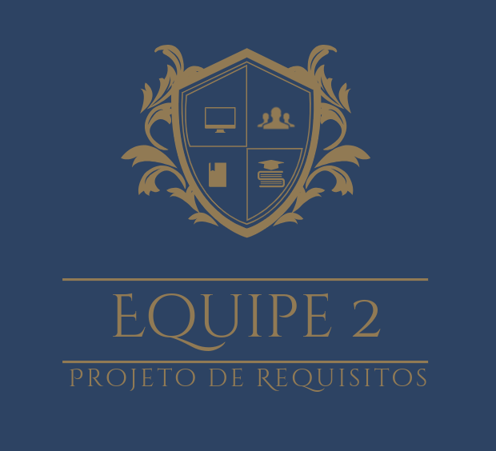

# 2024.1-Grupo02: Guardiões da saúde!

## :earth_americas: Quem somos:

  

  
  
   Figura 1: Logo da equipe criado [Aqui](https://www.designevo.com/).

Somos uma equipe que faz parte da disciplina de Requisitos de Software ministrada pelo professor André de Sales Barros na Universidade de Brasília (UnB). 

Com entusiasmo e dedicação, o nosso grupo planeja realizar um projeto  que se debruça sobre a análise dos requisitos necessários para o aplicativo “Guardiões da Saúde” .
## 👨‍🎓: Contribuidores

<table style="margin-left: auto; margin-right: auto;">
    <tr>
        <td align="center">
            <a href="https://github.com/brenoalexandre0">
                
                <h5 class="text-center">Breno Alexandre Soares Garcia   Matrícula: 200035703</h5>
            </a>
        </td>
        <td align="center">
            <a href="https://github.com/brunocva">
                
                <h5 class="text-center">Bruno Cunha Vasconcelos de Araujo   Matrícula: 221034973</h5>
            </a>
        </td>
       <td align="center">
            <a href="https://github.com/caiomesvie">
                
                <h5 class="text-center"> Caio Mesquita Vieira   Matrícula: 222024283   Github: caiomesvie</h5>
            </a>
        </td>
      <td align="center">
            <a href="https://github.com/Paxxaglia">
                
                <h5 class="text-center"> Iago Passaglia Perereia   Matrícula: 221037670</h5>
            </a>
        </td>
      <td align="center">
            <a href="https://github.com/SkywalkerSupreme">
                
                <h5 class="text-center">Larissa Stefane Barboza Santos   Matrícula: 211039573</h5>
            </a>
        </td>
      <td align="center">
            <a href="https://github.com/LuaMedeiros">
                
                <h5 class="text-center"> Luana de Lima Medeiros   Matrícula: 190091444</h5>
            </a>
        </td>
      <td align="center">
            <a href="https://github.com/Izarias">
                
                <h5 class="text-center"> Pedro Augusto Dourado Izarias   Matrícula: 200062620</h5>
            </a>
        </td>
      
</table>
